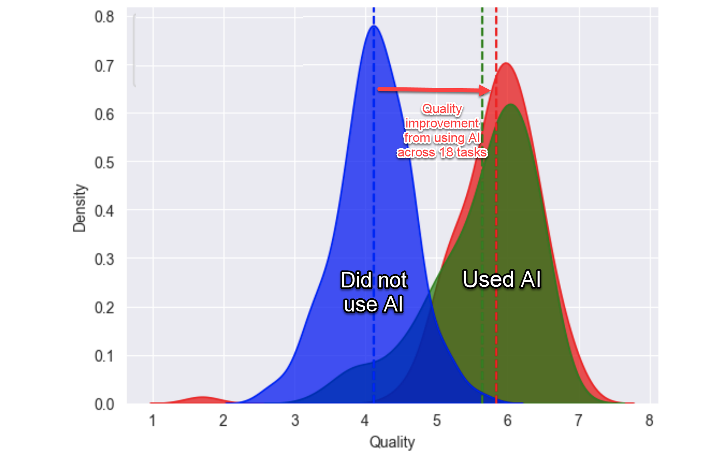
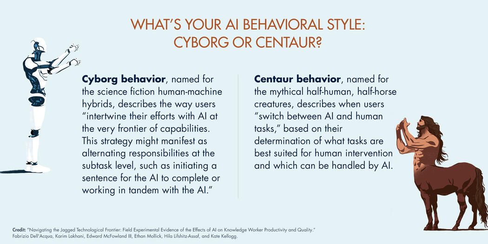

|         |
|-:|

# Intro

- Aparece una *tecnología* distruptiva: [Inteligencia artificial generativa](/documentos/AIgenerativa.md)
- Reacciones: [Duda](arteEsSoloHumano.md) / [Sorpresa, miedo, excepticismo, negación](https://docs.google.com/presentation/d/1UscAlHfjGgg4pPzz_p0V1eX18R74DRlvTtMXsbLVtI0/edit?usp=sharing) / [PessimistArchive](https://pessimistsarchive.org/) / [Ironía](/documentos/imagenes/publicidadGPT.jpeg) / [14/jun/2022: Debate sobre "sentience"](https://timesofindia.indiatimes.com/business/international-business/full-transcript-google-ai-bots-interview-that-convinced-engineer-it-was-sentient/articleshow/92178185.cms) → Dic 2025: El debate evolucionó de *sentience* a **agency, reasoning y multimodalidad** / [Olvidamos el pasado](olvidarPasado.md)
- [Ver dónde se inserta](/documentos/imagenes/modelosUML/5mas5mas5.svg)
- Aparecen términos nuevos... [*Ops](xOps.md) [AIOps](aiops.md) / Aparece [🌬️💨](💨.md) y más [🌬️💨💨💨](https://x.com/David_eficaz/status/1954120134429171859)
- [Se analiza su fiabilidad](/documentos/casosDeUso/fiabilidad.md) - [Se pone a prueba](/documentos/casosDeUso/diversosTest.md) ([con fechas](/documentos/casosDeUso/contarFechas.md), [con manzanas,](/documentos/casosDeUso/manzanas.md) [con perritos!!!](/documentos/casosDeUso/contarPerros.md)) -Se [entrena](/documentos/entrenamiento.md) -  [Se (intenta) regular](/documentos/etica@AI.md) / [Nos sorprendemos de sus respuestas](casosDeUso/conciencIA.md) / [Se (intenta) legislar](/documentos/legislacion@AI.md) / [Se cuestiona su valía en el proceso creativo](https://www.europarl.europa.eu/RegData/etudes/BRIE/2025/782585/EPRS_BRI(2025)782585_EN.pdf)

Y mientras todo esto ocurre, el debate se enriquece al compararlo con el ciclo de otras tecnologías (*NoCode, Blockchain, Criptodivisas / Ciberseguridad / otros...*), obligándonos a poner el foco en la [Calidad](calidadAI.md) para separar la señal del ruido.

## ¿Algo nuevo?

|[El ciclo de Sísifo de los pánicos tecnológicos](https://journals.sagepub.com/doi/full/10.1177/1745691620919372)|
|-|-|

|Teletrabajo|[Paradoja de la dirección](paradojaDireccion.md)|
|-|-|
|

|||
|-|-|
[Marco Aurelio Denegri](https://www.youtube.com/watch?v=L1_Y-CkBIvU)|*La sociedad informática y la era digital promueve con verdadero fervor cuatro ismos que nunca fueron promovidos de esa manera anteriormente: **el inmediatismo, el fragmentarismo, el superficialismo y el facilismo**. Como todo se delega, el ser humano termina lleno de prótesis (...) y en esa medida es adicto y completamente dependiente*
||
|**Frente a estos riesgos**, es fundamental adoptar un enfoque crítico y consciente:|
[Enrique Dans](https://www.enriquedans.com/2023/08/trabajo-y-algoritmos-generativos.html)|*Con la disponibilidad cada vez mayor y cada vez más segura de este tipo de herramientas, llegan tiempos y retos interesantes. La clave va a estar en **evitar simplemente «dejarnos llevar»** y aplicar una lógica de sostenibilidad en el tiempo y de conveniencia para todos los implicados, para que esas herramientas acaben trabajando para nosotros en lugar de trabajar nosotros para esas herramientas. Pensemos sobre ello.*
|[Enrique Dans](https://www.enriquedans.com/2023/04/tecnologia-y-regulacion-por-que-tendemos-siempre-a-ver-los-cambios-como-amenazas.html)|*Subestimar este tipo de herramientas es obviamente tan poco acertado como creer que son inteligentes o conscientes. Hablamos de algoritmos que (...) tendrán efectos importantes en todas las tareas y ocupaciones que utilicen el lenguaje bien como input (...) en las que probablemente **no veremos tanto una sustitución de personas por algoritmos, como una de personas que no saben manejar algoritmos por personas que sí saben hacerlo**.*
|*2Think:* [Paradoja de Moravec](https://es.wikipedia.org/wiki/Paradoja_de_Moravec)|*La principal lección de treinta y cinco años de investigación en IA es que los problemas difíciles son fáciles y los problemas fáciles son difíciles. Las habilidades mentales de un niño de cuatro años que damos por sentadas como reconocer una cara, levantar un lápiz, cruzar una habitación, responder una pregunta... resuelven algunos de los problemas de ingeniería más difíciles jamás concebidos. Con la aparición de una nueva generación de dispositivos inteligentes, serán los analistas de valores y los ingenieros petroquímicos y los miembros de la junta de libertad condicional quienes puedan quedar obsoletos por las máquinas. Por otra parte los jardineros, recepcionistas y cocineros pueden estar seguros en sus trabajos en las próximas décadas.*|
|[¿Hay una burbuja de la inteligencia artificial?](https://www.enriquedans.com/2024/04/hay-una-burbuja-de-la-inteligencia-artificial.html)|Sí, hay una burbuja. Sí, va a explotar, y se llevará por delante tanto a unas cuantas compañías creadas con expectativas poco realistas, como una buena cantidad de dinero de muchos inversores. Hay demasiadas compañías lanzándose a por inversión, demasiados modelos, demasiada excitación. Es evidente, y además, siempre pasa. Es inevitable, una parte de la naturaleza humana que se refleja en unos mercados que la amplifican enormemente.|
||Pero por mucho que explote momentáneamente, la inteligencia artificial es algo que está aquí para quedarse, y apostar por ella es lo que separará a las compañías con futuro de las que no lo tienen.|
||¿Está tu compañía invirtiendo con sentido común, buscando formas razonables de hacer las cosas, o está simplemente apuntándose a la moda y tirándose a la piscina? ¿O es de las que prefieren no hacer nada hasta que el panorama se clarifique y sea ya muy tarde como para recuperar el tiempo perdido?|
[MIT](https://mitsloan.mit.edu/ideas-made-to-matter/how-generative-ai-can-boost-highly-skilled-workers-productivity) [Harvard](https://mitsloan.mit.edu/sites/default/files/2023-10/SSRN-id4573321.pdf)|Los consultores con acceso a ChatGPT-4 completaron un 12,2% más de tareas en promedio, y lo hicieron un 25,1% más rápido, con resultados de calidad significativamente más alta (más de un 40% más de calidad en comparación con el grupo de control). 
||Estos resultados se aplicaron a todos los consultores: los que estaban por debajo del umbral de desempeño promedio aumentaron un 43%, mientras que los que estaban por encima aumentaron un 17 % en comparación con sus propios puntajes. 

En la gráfica, puede verse la distribución de la calidad del output entre todas las tareas: 
el grupo azul no usó ChatGPT, mientras que los grupos verde y rojo sí lo usaron. 
Además, el grupo rojo recibió capacitación adicional sobre cómo utilizarlo.

[Matriz de interacción bidireccional](matrizBidireccional.md)

## Estado actual (Diciembre 2025)

Tras años de evolución acelerada, y habiendo reflexionado sobre los ciclos históricos de las tecnologías disruptivas, la IA generativa ha alcanzado un punto de inflexión:

|Dimensión|Hito reciente|Implicación|
|-|-|-|
|**Modelos de lenguaje**|GPT-5.2 (dic '25), Gemini 3 (nov '25), Claude Opus 4.5 (nov '25), Grok 4.1 (nov '25)|La ["carrera de 25 días"](https://vertu.com/lifestyle/the-ai-model-race-reaches-singularity-speed/) (17 nov - 11 dic) avanzó más que [años completos anteriores](https://felloai.com/the-best-ai-of-december-2025/)
|**De herramientas a agentes**|Antigravity, Claude Code, Cursor 2.0, Windsurf con Gemini 3|Ya no solo asisten: **planifican, ejecutan y verifican** autónomamente
|**Multimodalidad nativa**|Sora 2, Gemini 3 Deep Think, NotebookLM Plus|Texto, imagen, video, audio - integrados desde el diseño
|**Democratización**|Versiones gratuitas potentes, APIs accesibles, IDEs agent-first|La barrera ya no es el acceso, sino **saber dirigir**
|**Debate evolucionado**|De "¿es consciente?" a "¿cómo colaboramos?"|[Paradoja de la dirección](paradojaDireccion.md): competencia directiva > capacidad ejecutiva

Conociendo los ciclos históricos, entendiendo los riesgos del inmediatismo y el superficialismo, y conscientes de que las burbujas son inevitables pero la tecnología permanece, el reto actual no es tecnológico sino **metodológico y cultural**: aprender a colaborar eficazmente con sistemas que ejecutan mejor que nosotros pero necesitan nuestra dirección estratégica.

## Siguientes pasos

Has navegado por el "porqué" de este repositorio, un contexto denso y crítico. Ahora puedes continuar tu viaje de varias maneras:

- **[Volver al índice (README)](/README.md)** para tener la imagen completa de la estructura.
- **[Seguir un itinerario guiado](/documentos/itinerarios/)** si prefieres un camino estructurado.
- **[Explorar la panorámica general](/documentos/panoramica.md)** para obtener una visión de alto nivel.
- **[Saltar a los casos de uso](/documentos/casosDeUso/README.md)** si buscas aplicación práctica inmediata.
