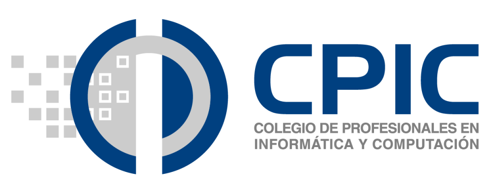

|          |
|-:|

# Tiempos modernos: transformadores tecnológicos y sociales

Expresar una idea creativa dependía de la habilidad artística humana, amén de la interpretación personal.

|||
|-|-|
|||

Con la aparición de la técnica, este proceso se factoriza: técnica + interpretación.

https://github.com/user-attachments/assets/720ad51c-7dc6-4f60-8f13-598cd8282d84

|Fernando de Szyszlo
|:-:
|[Vídeo completo](https://youtu.be/-Rp5I5H4MAk?si=zue1RWIgpKntcWum&t=439)

## ¿Por qué?

Cada vez que aparece una tecnología disruptiva se genera un ***ciclo de adaptación*** que revela nuestra relación compleja con la innovación:

|||
|-|-|
|Duda|[¿Es el arte una característica humana?](/documentos/arteEsSoloHumano.md)|
||[Can't help myself](https://historia-arte.com/obras/can-t-help-myself) / [📽️](https://www.youtube.com/watch?v=4ooVr6RZ_nw)
|Reacciones|[Sorpresa, miedo, negación](https://docs.google.com/presentation/d/1UscAlHfjGgg4pPzz_p0V1eX18R74DRlvTtMXsbLVtI0/edit?usp=sharing) / [PessimistArchive](https://pessimistsarchive.org/)
||[Ironía](/documentos/imagenes/publicidadGPT.jpeg) ([*o no...*](https://www.1x.tech/neo)) --> [*Unboxing*](https://x.com/nothing/status/1894007732044259657)
|Recurrencia y ciclos|[Esto ya lo he visto](/documentos/olvidarPasado.md)
||Ocurrió y no lo ví: [@Jun2022](https://timesofindia.indiatimes.com/business/international-business/full-transcript-google-ai-bots-interview-that-convinced-engineer-it-was-sentient/articleshow/92178185.cms)
||[@Feb2025: *Is AI a bubble?*](https://qz.com/ai-tech-stocks-dot-com-bubble-markets-1851768177) (***Spoiler***: [*sí, pero no es tan malo*](https://www.enriquedans.com/2024/04/hay-una-burbuja-de-la-inteligencia-artificial.html))
||[@Mar2025, hace pocos días](https://x.com/DaniNovarama/status/1907354905540522184)
||**El patrón histórico: de brechas a puentes** - La imprenta, el teléfono, internet - inicialmente divisores, finalmente conectores|
||**La paradoja actual:** tecnologías diseñadas para conectar que a veces nos separan más|
|Inserción|[¿A la fuerza?](/documentos/imagenes/modelosUML/5mas5mas5.svg)
||"Aparecen" términos nuevos que reflejan tensión... *FOMO* / *JOMO*, *Nomofobia*, *Infoxicación*, *Cibercondría*
||"Aparecen" términos que reflejan integración... comunidades digitales, inteligencia colectiva, co-creación
||Otros "desaparecen" o reducen su volumen: *NoCode / Blockchain / Criptodivisas / Ciberseguridad / otros...* */ [Calidad](/documentos/calidadAI.md)*
||Aparecen [🌬️💨](/documentos/💨.md) que se saltan una [aproximación metodológica](https://docs.google.com/spreadsheets/d/12ZWrmk_hv4i6X0tUPkBYEHCHynxTdQNHClmBFpjqbJc/edit?gid=0#gid=0)
||[Se analiza su fiabilidad](/documentos/casosDeUso/fiabilidad.md) 
||Se estudia, se [entrena](/documentos/entrenamiento.md) 
|| [Se (intenta) regular](/documentos/etica@AI.md)

---

|Brechas actuales
|-
|Entre quienes adoptan tempranamente y quienes resisten al cambio|
|Entre diferentes generaciones y sus formas de relacionarse con la tecnología|

## ¿Qué?

|LLMs|||
|-|-|-|
|**Modelo de lenguaje a gran escala**|Modelos avanzados de aprendizaje automático diseñados para procesar y generar texto, entrenados en grandes cantidades de datos textuales de modo que son capaces de entender y producir lenguaje similar al humano.|¿Autocompletar? ¿Solo eso?|

|*Los LLMs generan nuevo contenido, convirtiéndolos en una forma de "IA generativa".*
|-|
|

¡Pero ya un año antes (el 2018) Google presentaba esto!

https://github.com/user-attachments/assets/34f0965c-5ac6-4407-b1c9-02aded972969

***En realidad, lo que es importante entender es que estas herramientas no se limitan en absoluto a copiar, recombinar y pegar, sino que llevan a cabo procesos estadísticos como la inferencia, la correlación o la estadística bayesiana, muy parecidos a los que lleva a cabo nuestro cerebro cuando aprende. Menospreciar al algoritmo y reducirlo a un supuesto papel de «mono estocástico» puede ser un craso error.*** -- [Enrique Dans](https://www.enriquedans.com/2023/08/trabajo-y-algoritmos-generativos.html)

### Componentes

|Estructurales
|:-:|
||
<u>**Secundarios:**</u>
Infraestructura
Curado de datos
Seguridad, privacidad, [ética, sesgo](/documentos/etica.sesgo.md)

## ¿Para qué?

Existe un impacto en diversas disciplinas que hemos de **saber reconocer y dimensionar**

| Disciplina | IA@Disciplina |
|-|-|
|**Lingüística**|[Impacto de la IA en la evolución del lenguaje](/documentos/casosDeUso/influenciaLLMsLenguaje.md) |
|**Ética**|[Dilemas éticos](/documentos/casosDeUso/dilemaEtico.md) en la toma de decisiones automatizada |
|**Filosofía**|[Debates sobre el libre albedrío](https://openreview.net/pdf?id=W3VsHuga3j) y determinismo en sistemas de IA |
|**Psicología**|Efectos de la IA en el comportamiento y cognición humana |
|**Antropología**|Cambios culturales debido a la integración de IA en la sociedad |
|**Historia**|Análisis del desarrollo histórico de la IA |
|**Artes**|IA en la creación artística (música, pintura, literatura) |
|**Sociología**|Dinámicas de poder alteradas o exacerbadas por la IA |
|| Aparición o incremento de desigualdades debido a la IA |
|| Impacto de la IA en la estructura social y laboral |

### La tecnología como elemento de servicio

Más allá de estos impactos específicos, debemos recordar que **la tecnología es un elemento de servicio**. No existe para sí misma, sino para facilitar y potenciar las capacidades humanas. Como profesionales de la informática, debemos preguntarnos constantemente:

- ¿Estamos creando soluciones que realmente sirven a las necesidades humanas?
- ¿O estamos obligando a los humanos a adaptarse a nuestra visión tecnológica?

|[12:00](https://es.wikipedia.org/wiki/Problema_del_doce_parpadeante)|[Google Wave](https://es.wikipedia.org/wiki/Apache_Wave) [📹](https://www.youtube.com/watch?v=v_UyVmITiYQ)|
|:-:|:-:|
|||
||[PdC](https://docs.google.com/presentation/d/1qQXZE0g10PZHzisHxJbp32Dkxx9gktXhPHh3fNLmgDs/edit?slide=id.g13b61317ea1_0_118#slide=id.g13b61317ea1_0_118)|

## ¿Cómo?

> *los usuarios no prefieren los productos porque sean inherentemente más sencillos de usar, sino porque **parecen** más sencillos.*
>
> Neal Stephenson

Esta sutil diferencia es clave para entender cómo la tecnología debe tender puentes en lugar de crear brechas.

|Lectura recomendada|[*En el principio... fue la línea de comandos*](https://biblioweb.sindominio.net/telematica/command_es/)|
|-|-|
|Ensayo del escritor estadounidense Neal Stephenson, publicado originalmente en Internet en 19991​ y más tarde ese mismo año en forma de libro, donde se postula que *“los usuarios no prefieren los productos de Microsoft y Apple porque sean inherentemente más sencillos de usar que los de Linux, sino porque parecen más sencillos de usar y porque confían en que el servicio técnico de Apple y Microsoft se hará cargo de cualquier avería que pueda surgir…”*|

### Aspectos de la interacción entre IA y otras disciplinas

| Reciprocidad | Transformación mutua | Nuevos campos de estudio | Desafíos y oportunidades | Impacto cultural y social | Mejora mutua |
|-|-|-|-|-|-|
| Cada disciplina no solo se ve afectada por la IA, sino que también influye significativamente en su desarrollo. | Tanto las disciplinas como la IA están evolucionando como resultado de esta interacción.  | Ej.: ética de la IA, la antropología digital, o la ***creación artística asistida por IA***. | Que surgen de esta interacción. | Que las disciplinas humanistas están ayudando a comprender y abordar. | En muchos casos, vemos cómo la interacción entre la IA y las disciplinas humanistas conduce a mejoras en ambos campos. |

