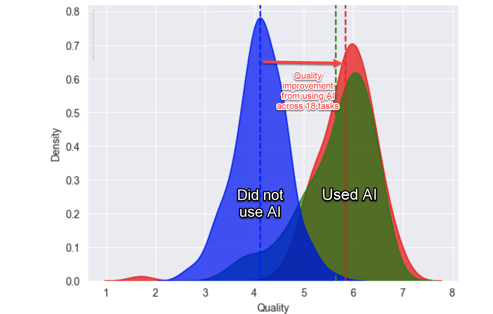
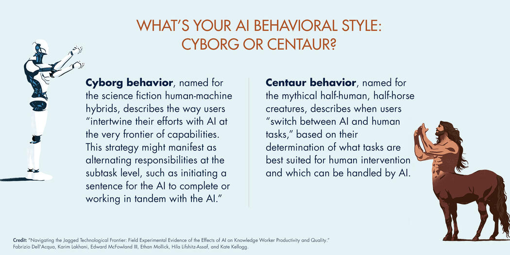

# Itinerario U2

*Una reflexión de 30 minutos sobre la inteligencia artificial y nuestro futuro laboral*

## ¿Por qué?

### ¿Nos suena familiar?

> *"La sociedad informática y la era digital promueve con verdadero fervor cuatro ismos que nunca fueron promovidos de esa manera anteriormente: **el inmediatismo, el fragmentarismo, el superficialismo y el facilismo**. Como todo se delega, el ser humano termina lleno de prótesis (...) y en esa medida es adicto y completamente dependiente"*
> 
> — [Marco Aurelio Denegri](https://www.youtube.com/watch?v=L1_Y-CkBIvU)

¿Cuántas veces hemos escuchado esto mismo sobre otras tecnologías? ¿El teléfono móvil? ¿Internet? ¿Las redes sociales?

### El eterno ciclo del miedo tecnológico

*Fuente: [El ciclo de Sísifo de los pánicos tecnológicos](https://journals.sagepub.com/doi/full/10.1177/1745691620919372)*

**Reflexión inicial:** Cada nueva tecnología genera las mismas reacciones: sorpresa, miedo, escepticismo, negación. Pero al final, se integra en nuestras vidas de forma natural.

### La historia se repite

#### El mundo lleva *cambiando para siempre* desde hace unos 5000 años...

|Período|Tecnología|¿Qué pasó?|
|-|-|-|
|**1990s-2001** | [Burbuja PuntoCom](https://es.wikipedia.org/wiki/Burbuja_puntocom) | Crecimiento desmesurado en empresas de Internet. Muchas quebraron, pero Internet se quedó y transformó el mundo |
|**1920s** | [Radiomanía](https://es.wikipedia.org/wiki/Radioman%C3%ADa) | Inversión masiva en radio durante los "felices años veinte". Crisis de 1929, pero la radio revolucionó la comunicación |
|**1840s** | [Railway Mania](https://es.wikipedia.org/wiki/Railway_Mania) | Locura especulativa por los ferrocarriles en Gran Bretaña. Burbuja explotó, pero el tren cambió la historia |
|**1790s** | [Globomanía](https://es.wikipedia.org/wiki/Globoman%C3%ADa) | Fascinación por los globos aerostáticos en Francia. Pasó la moda, pero nació la aviación |

#### ¿Estamos en una burbuja de IA?

> *"Sí, hay una burbuja. Sí, va a explotar (...) Pero por mucho que explote momentáneamente, **la inteligencia artificial es algo que está aquí para quedarse**, y apostar por ella es lo que separará a las compañías con futuro de las que no lo tienen."*
> 
> — [Enrique Dans](https://www.enriquedans.com/2024/04/hay-una-burbuja-de-la-inteligencia-artificial.html)

**Mensaje clave:** Las burbujas explotan, pero la tecnología útil permanece y transforma la sociedad.

## ¿Qué?

### Inteligencia artificial generativa

La [IA generativa](/documentos/AIgenerativa.md) es una tecnología que puede **crear contenido nuevo**: texto, imágenes, presentaciones, emails... como si fuera un asistente muy inteligente que entiende lo que le pides y te ayuda a hacerlo.

|Qué|Antes||Ahora (ayudado por la IA)|
|-|:-:|-|:-:|
|Redactar un email formal|15-20 minutos||2-3 minutos|
|Resumir un documento de 20 páginas|2-3 horas||5-10 minutos|
|Crear una agenda de reunión|30 minutos||5 minutos|
|Escribir un comunicado interno|1 hora||15-20 minutos|

### Los datos no mienten

**Estudio MIT/Harvard:** Los trabajadores con acceso a ChatGPT-4:

- Completaron **12,2% más tareas**
- Las hicieron **25,1% más rápido**
- Con **40% más calidad**

> *"probablemente **no veremos tanto una sustitución de personas por algoritmos, como una de personas que no saben manejar algoritmos por personas que sí saben hacerlo**."*
>
> — [Enrique Dans](https://www.enriquedans.com/2023/04/tecnologia-y-regulacion-por-que-tendemos-siempre-a-ver-los-cambios-como-amenazas.html)

## ¿Para qué?

### Dos paradigmas que conocemos bien

|Paradoja del teletrabajo|Paradoja de la dirección|
|-|-|
|||
|Permite trabajar desde cualquier lugar... | Tenemos más herramientas de comunicación... |
|...pero algunos se sienten más aislados | ...pero a veces nos comunicamos peor |
|La tecnología existe, el reto es **cómo la usamos** | La tecnología mejora, pero las **habilidades humanas** siguen siendo clave |

### Dos formas de relacionarnos con la IA

|Cyborg|Centauro|
|:-:|:-:|
|Dependencia total de la máquina, perdiendo habilidades humanas|Humano y máquina trabajando juntos, cada uno aportando sus fortalezas|

### *2Think:*

**¿Qué tareas de su día a día podrían beneficiarse de automatización inteligente?**

Piensen en:

- Tareas repetitivas que consumen mucho tiempo
- Procesos que requieren seguir siempre el mismo formato
- Situaciones donde necesitan ayuda para expresarse mejor por escrito
- Momentos donde tienen que procesar mucha información rápidamente

## El futuro es humano + IA

### Lo que hemos aprendido

1. **La historia se repite:** Cada tecnología disruptiva genera miedo, pero las útiles se quedan
2. **Los datos son claros:** Quienes usan IA bien son más productivos y eficaces
3. **El factor humano es clave:** La tecnología amplifica nuestras capacidades, no las reemplaza
4. **La elección es nuestra:** Podemos ser centauros o cyborgs

### La pregunta final

> *"Con la disponibilidad cada vez mayor (...) de este tipo de herramientas, llegan tiempos y retos interesantes. La clave va a estar en **evitar simplemente «dejarnos llevar»** (...) para que esas herramientas acaben trabajando para nosotros en lugar de trabajar nosotros para esas herramientas."*
> 
> — [Enrique Dans](https://www.enriquedans.com/2023/08/trabajo-y-algoritmos-generativos.html)

**No es si la IA va a cambiar cómo trabajamos - ya lo está haciendo.**

**La pregunta es: ¿preferimos ser parte activa de este cambio o que nos pille desprevenidos?**

*"Como hemos visto a lo largo de la historia, quien se adapta con inteligencia y criterio, prospera."*

## ¿Cómo?

|Aproximarnos|Comprender o entender |Aplicación real|
|:-:|:-:|:-:|
|[Panorámica](../panoramica.md)|[Modelos de lenguaje](../LLMs.md), [Prompts](../prompts/README.md), [Ingeniería de Prompts](../ingenieriaDePrompts/README.md) & [Patrones](../ingenieriaDePrompts/patrones/README.md)|[Casos de Uso](../casosDeUso/README.md)|

1. ***Introducción a la IA y su estado actual***, revisando implementaciones de diversos servicios y centrándonos en los modelos de lenguaje que implementan el chatbot como interface.
1. Luego una ***breve (brevísima!!!, todo lo breve que sea posible!!!) pero necesaria base teórica*** en la que veremos prompts, ingenieria de prompts y buenas prácticas en ambos casos.
1. Finalmente -y con esta base revisada- explorar ***escenarios prácticos*** que harán uso de estas herramientas, de modo que exploraremos cómo nos puede(n) ayudar en la búsqueda de mejorar la eficiencia.

> Al finalizar, se habrán visto un conjunto de casos de uso que se apoyan en la IA y en otras tecnologías, con la intención de que puedan extraer lo mejor de cada uno de ellos y tengan una idea de como empezar a aplicarlos.

### Debate@U

Luego de ver todo esto, si nos da tiempo, comentamos...

- El factor [ético](/documentos/etica@AI.md), de seguridad, su [legislación](/documentos/legislacionAI.md) y el desafio de la [regulación](/documentos/regulacionAI.md)
